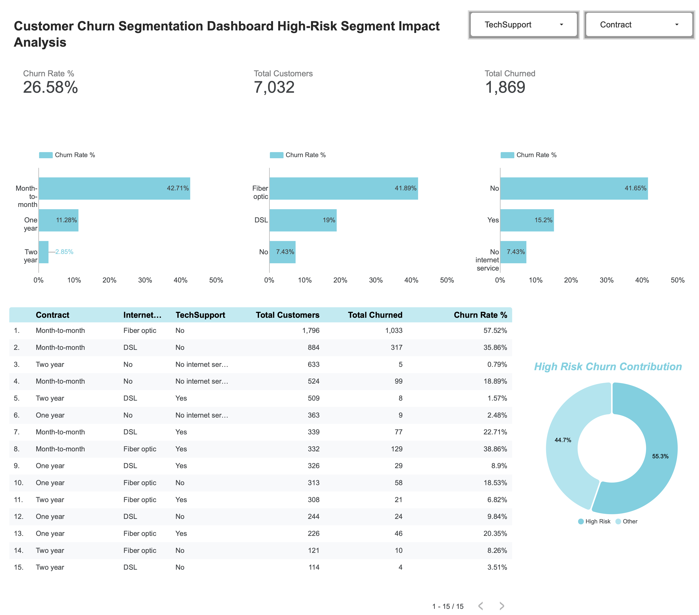

## Customer Churn Analysis — End-to-End Segmentation & Impact Modelling

### Project Overview

This project analyses customer churn using Python, Excel, and SQL to identify high-risk customer segments and model data-driven retention strategies.

The objective was to

	•	Identify which customers churn the most
	•	Quantify segment contribution to overall churn
	•	Model the business impact of targeted interventions
	•	Translate analytical findings into actionable strategy

Dataset size: 7,032 customers

### Tools & Technologies
	•	Python (Pandas, aggregation, segmentation logic)
	•	Excel (Pivot tables, churn modelling, weighted impact calculations)
	•	MySQL (SQL aggregation, CASE logic, segmentation queries)
	•	Looker Studio (dashboard visualisation)

### Baseline Metrics
	•	Overall churn rate: 26.58%
	•	Total churned customers: 1,869

### Key Findings

#### 1. Contract Length is the Strongest Driver

| Contract  | Churn Rate |
| ------------- | ------------- |
| Month-to-month  | 42.7%  |
| One year  | 11.3%  |
| Two year  | 2.9%  |

Short-term contracts churn nearly 15x more than two-year contracts.

#### 2. Service Risk Concentration
	•	Fiber optic customers churn at 41.9%
	•	Customers without TechSupport churn at 41.7%
	•	Customers with TechSupport churn at only 15.2%

Lack of support significantly increases churn risk.

#### 3. High-Risk Segment Identified
Defined as:

	•	Month-to-month
	•	Fiber optic
	•	No TechSupport

Segment metrics:

	•	25.5% of customers
	•	57.5% churn rate
	•	Contributes 55.3% of total churn
This indicates strong churn concentration within a specific behavioural profile.

### Impact Modelling

Scenario:        
Reduce high-risk churn from 57.5% → 47.5%

Result:

	•	Overall churn drops from 26.6% → 24.0%
	•	2.6 percentage point improvement
	•	Significant revenue retention potential
For 100,000 customers at $70 ARPU, this equates to ~$2M+ annual revenue preserved.

### Dashboard Preview

### Business Recommendation
	•	Test free TechSupport intervention via A/B testing
	•	Incentivise transition to longer contracts
	•	Investigate fiber service experience gaps
